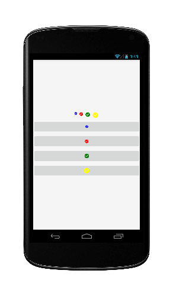
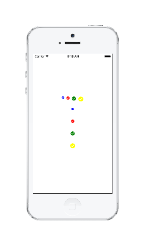
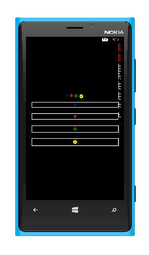

# Google Material Icons for Xamarin.Forms

A cross platform control library for using the Google Material Icon font. Icon font provided by **[Google](https://github.com/google/material-design-icons)** under the **[Creative Common Attribution 4.0 International License (CC-BY 4.0)](http://creativecommons.org/licenses/by/4.0/)**.
Icon images and names can be found here: [https://www.google.com/design/icons/](https://www.google.com/design/icons/)

  

## Controls
* IconButton
* IconLabel

## Supported Platforms
* Windows Phone 8 (Silverlight)
* Xamarin.Android (AppCompat)
* Xamarin.iOS (Unified)

## Setup
Add the NuGet package (https://www.nuget.org/packages/Xam.FormsPlugin.MaterialIcons) to your PCL and platform projects.

### PCL

#### Xaml
First add the xmlns namespace:

`
xmlns:mi="clr-namespace:MaterialIcons.FormsPlugin.Abstractions;assembly=MaterialIcons.FormsPlugin.Abstractions"
`

Then add the xaml:

`
<mi:IconLabel Icon="ic_check_circle" FontSize="12" TextColor="Blue" />
`

Icon names are in the form of **ic_{ligature_name}**

### Android
Initialize the control library

`
Xamarin.Forms.Init(this, savedInstanceState);
MaterialIconControls.Init();
`

### iOS
**Important:** You must add the custom font to your Info.plist

`
<key>UIAppFonts</key>
<array>
    <string>MaterialIcons-Regular.ttf</string>
</array>
`

Initialize the control library

`
Xamarin.Forms.Init();
MaterialIconControls.Init();
`

### Windows Phone
Initialize the control library

`
Xamarin.Forms.Init();
MaterialIconControls.Init();
`

#### Contributors
* [jsmarcus](https://github.com/jsmarcus)

Thanks!

#### License
Licensed under MIT License see license file.
